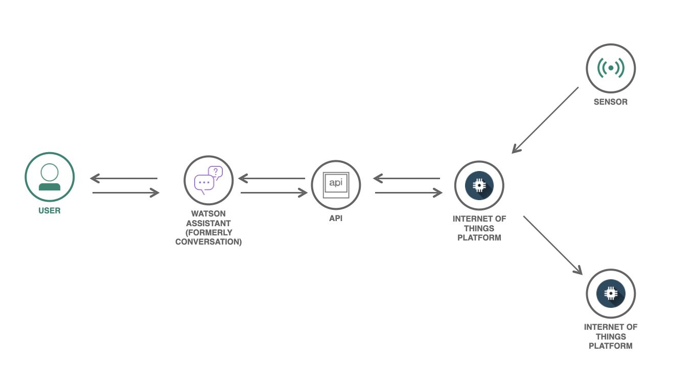

# Laboratório | Watson+IoT

## Introdução

Este é um laboratório com a finalidade de demonstrar como conectar dispositivos IoT no [IBM IoT Platform](https://cloud.ibm.com/catalog/services/internet-of-things-platform) e obter informações do dispositivo e enviar comandos para os mesmos. Não é necessário possuir um dispositivo IoT para concluir esse laboratório, pois será implementado durante o laboratório um software em python capaz de ler sinais e agir sobre determinadas condições e que pode ser utilizado em um dispositivo IoT.

Também será implementado um integração entre o IoT com o [Watson Assistant](https://cloud.ibm.com/catalog/services/internet-of-things-platform) de forma que a leitura de sinais e envio de comandos seja feita em linguagem natural para simplificar a utilização da tecnologia.

A arquitetura da aplicação a ser construída nesse laboratório está represetada na Figura 1, disponibilizada logo abaixo.

    
    
Figura 1: Arquitetura do Laboratório.

## Pré-requisitos

Para realizar esse laboratório você deverá cumprir os seguintes pré-requisitos:

- Possuir uma conta na [IBM Cloud](https://ibm.biz/Bdq3Nw), podendo ser a conta FREE ou pay-as-you-go.
- [Python 3](https://www.python.org/downloads/) instalado junto com gerenciado de pacotes [pip](https://pip.pypa.io/en/stable/installing/); ou para simplificar uma conta no [repl.it](https://repl.it), para simularmos o dispositivo IoT.

## Passo a Passo

1. Criar conta na [IBM Cloud](#) e fazer o login;
2. Instanciar o IBM IoT Platform;
3. Adicionar um dispositivo a plataforma;
4. Criar uma API KEY no IBM IoT Platform com acesso padrão para visualizar os dados e enviar comandos;
5. Criar API para devolver os dados do sensor IoT e enviar comandos ao dispositivo;
6. Instanciar Watson Assistant;
7. Criar diálogo no Watson Assistant capaz de puxar os dados do dispositivo;
8. Criar diálogo no Watson Assistant capaz de enviar comandos ao dispositivo IoT;
9. Plugar o endereço da API criada no Watson Assistant.
10. Testar :)

## Workshop Gravado

[Watson+IoT](https://youtu.be/3qbUn1PXWns) disponível no YouTube.

## Documentação

- [IBM IoT Platform Docs](https://cloud.ibm.com/docs/IoT/index.html)
- [IBM IoT Platform Python-SDK Docs](https://ibm-watson-iot.github.io/iot-python/)
- [Watson Assistant Docs](https://cloud.ibm.com/docs/assistant?topic=assistant-getting-started)

## License

Copyright 2020 João Pedro Poloni Ponce

Licensed under the Apache License, Version 2.0 (the "License");
you may not use this file except in compliance with the License.
You may obtain a copy of the License at

       http://www.apache.org/licenses/LICENSE-2.0

Unless required by applicable law or agreed to in writing, software
distributed under the License is distributed on an "AS IS" BASIS,
WITHOUT WARRANTIES OR CONDITIONS OF ANY KIND, either express or implied.
See the License for the specific language governing permissions and
limitations under the License.